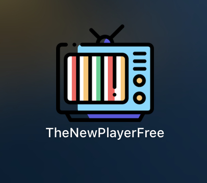
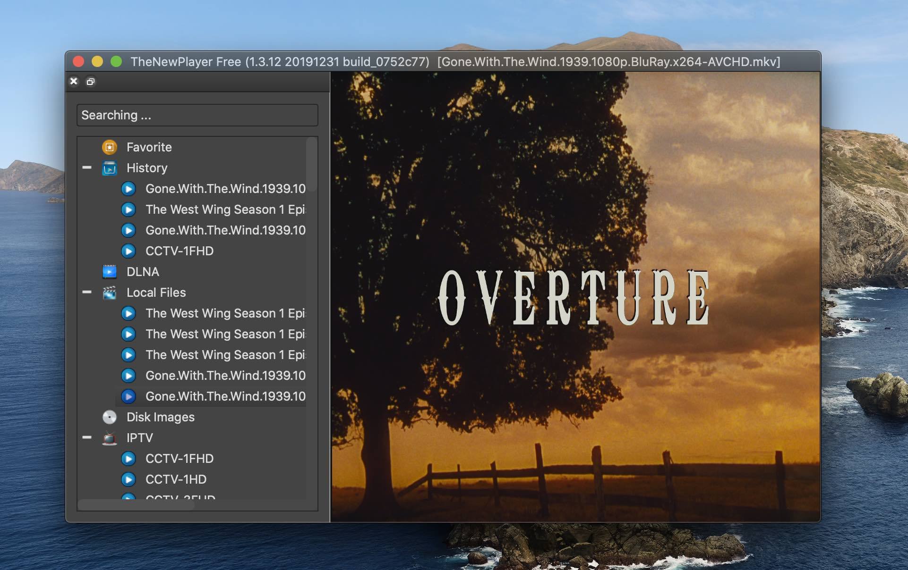
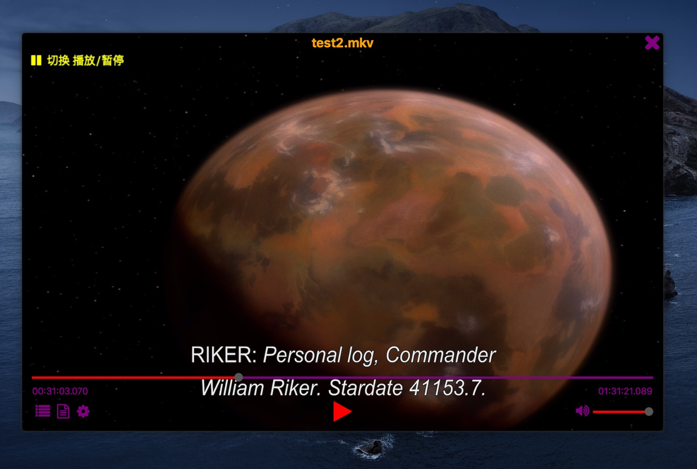
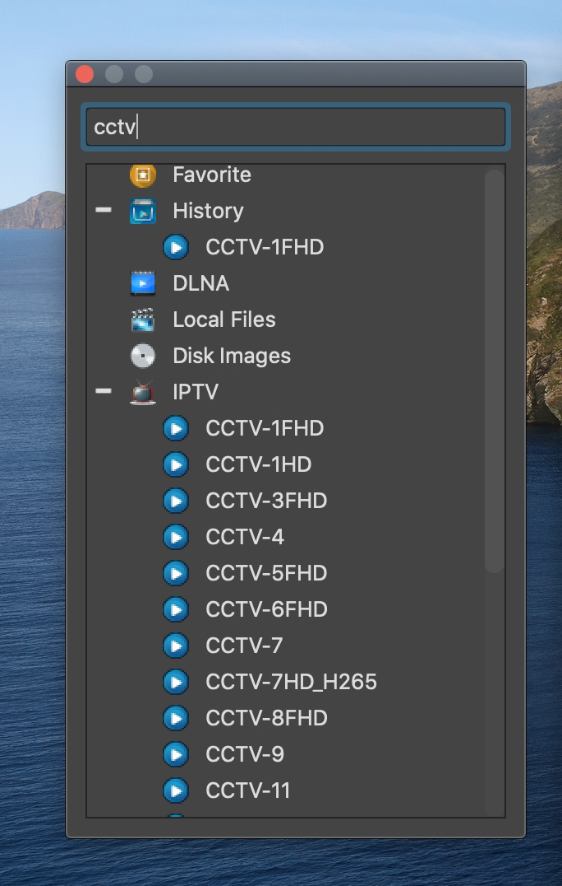
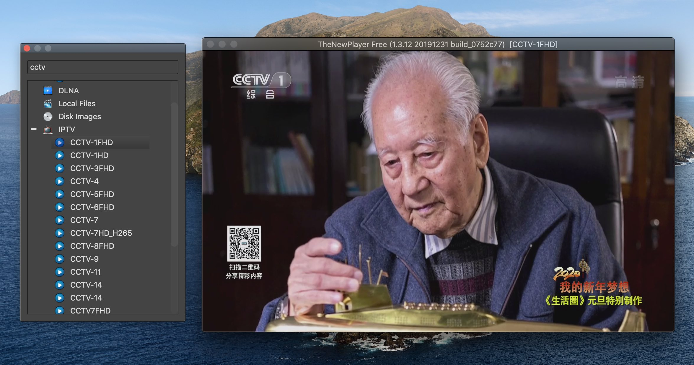
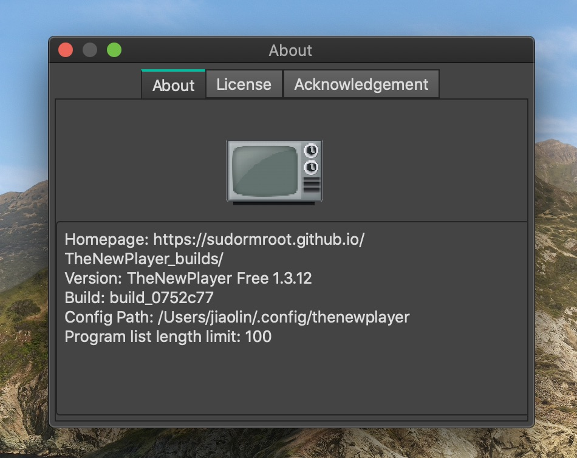
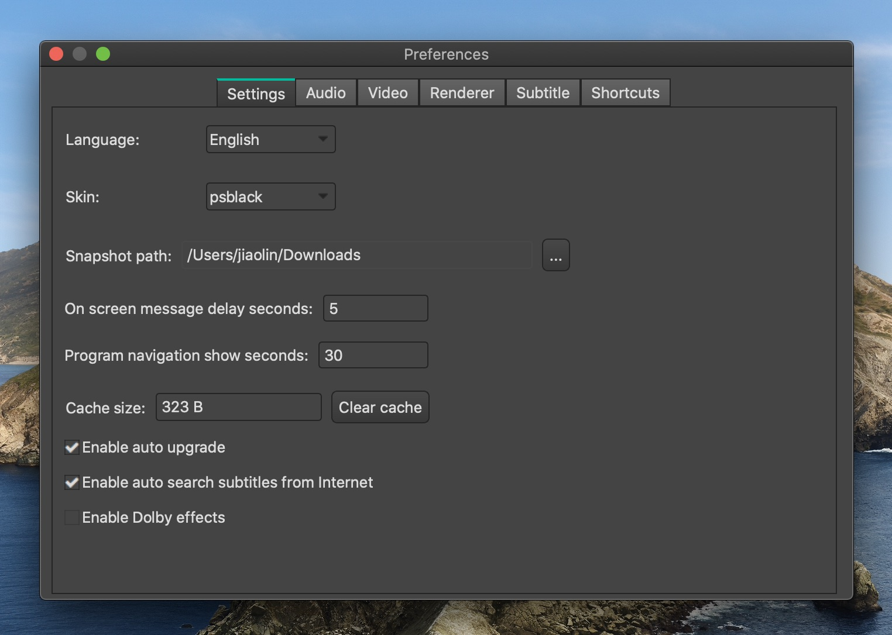
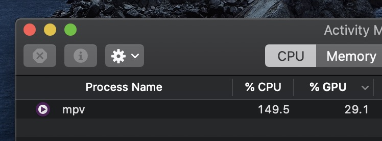
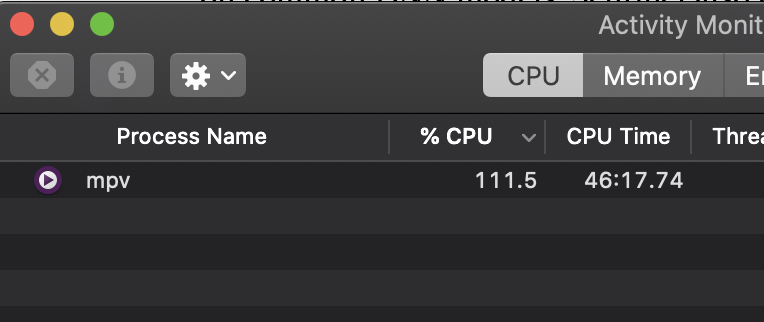

# Home Page
[https://sudormroot.github.io/TheNewPlayer_builds/](https://sudormroot.github.io/TheNewPlayer_builds/)

email: sudormroot@163.com

# Motivations

Watching IPTV programs is hard in macOS platform, since most existing applications are built merely for Windows or Android. That is the first motivation why I develop this application for macOS. The graphic rendering is based on OpenGL, which is responsible for automatically renderring frames onto the computer screen. The decoding library is from FFMPEG, the front-end UI library is from QT.

The second reason why this project is built is that receiving analog TV programs with GNU SDR (Software-defined Radio) is fascinating, if I can build a software to do so, that would be a wonderful experience, in a sense, we can reflect our past again - the pre-ditigal times where we were living ever.

# Install via brew

Ref: https://brew.sh

brew search thenewplayerfree

## Install from brew (not working currently)
brew cask install thenewplayerfree
* according to the policies of brew, the stars need to be above 50 at least, otherwise the project will not be accepted to be in the repo of brew cask. Once the stars are 50, I'll add thenewplayerfree to brew again.

## Uninstall
brew cask uninstall thenewplayerfree

# FAQS
## Why the OpenTV does not provide IPTV source file?
The OpenTV is merely a player for playing the content offered by your content providers. For this reason, based on copyright laws or codes, the OpenTV software would not provide any channel source files or contents. From your side, you also have the obligatory to obey the laws or codes in your areas or countries.

## How to setup the IPTV channel list?
1. Download IPTV source txt or m3u or m3u8 files to local.
2. Drag the txt or m3u or m3u8 channel list file to the player's window directly.
3. The player will automatically recognize the channel file format and build the IPTV channel.

# Troubleshooting

## Remove all configuration files, and navigation channel lists.
1. cd ~/.config/thenewplayer
2. rm -rf \*.txt upgrade objectstate playstate
3. Reboot the player.

# Screenshots

