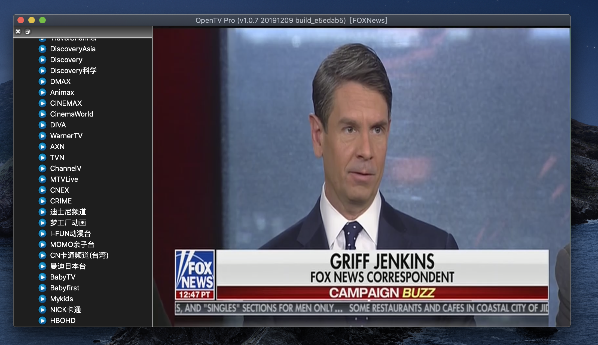
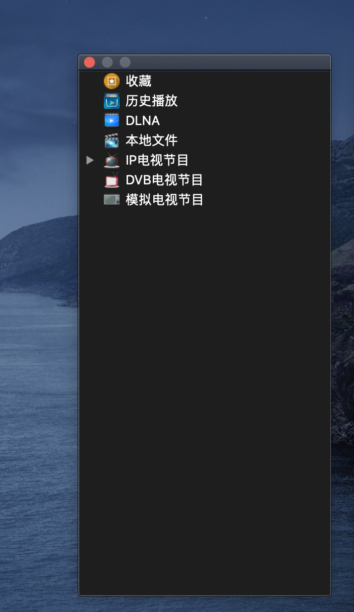

# MOTIVATIONS

Watching IPTV programs is hard in macOS platform, since most existing applications are built merely for Windows or Android. That is the first motivation why I develop this application for macOS. The graphic rendering is based on OpenGL, which is responsible for automatically renderring frames onto the computer screen. The decoding library is from FFMPEG, the front-end UI library is from QT.

The second reason why this project is built is that receiving analog TV programs with GNU SDR (Software-defined Radio) is fascinating, if I can build a software to do so, that would be a wonderful experience, in a sense, we can reflect our past again - the pre-ditigal times where we were living ever.

