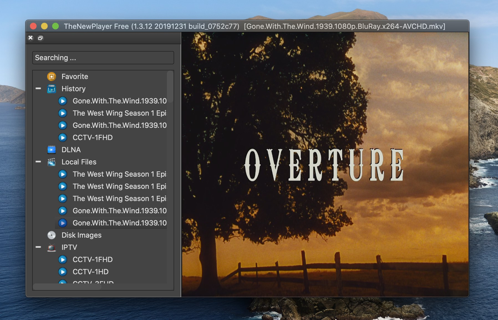

# Current version
v1.7.6

# Home Page
[https://sudormroot.github.io/nextplayer-project/](https://sudormroot.github.io/nextplayer-project/)

# Supported platforms

macOS, FreeBSD, OpenBSD and Linux

# Download
## macOS:
[https://github.com/sudormroot/nextplayer-project/releases](https://github.com/sudormroot/nextplayer-project/releases)

## Linux:
[https://github.com/sudormroot/nextplayer-project/releases](https://github.com/sudormroot/nextplayer-project/releases)

## FreeBSD:
[https://github.com/sudormroot/nextplayer-project/releases](https://github.com/sudormroot/nextplayer-project/releases)

# Installation
## FreeBSD
$ sudo pkg install nextplayer-bin.freebsd.xxx.txz

## Linux 
$ dpkg -i nextplayer-bin.linux.xxx.deb

### No sound problem:
Please do a google search with 'linux qt no sound' and fix the problem by installing extra libraries.

## macOS
Just drag the uncompressed app into anywhere of your macOS, such as the Application folder.

# How to report or fix bugs for users or developers of another one or two millenniums from now on (1000-2000 years later)
As far as this project is archived in github's Arctic Code Vault eternally, one problem is raised that how future users report and fix bugs in my player. I have no answers so far, but I will keep eyes on new technologies such as uploading mind for instance that enables us to do so.

# Usage
All operation logic in this app is dragging, which means you can drag the local video files or program list (txt/m3u/m3u8) to the main window (not the program navigation window), and you can drag program item to favorite of the navigation window.

# Motivations

Watching IPTV programs is hard in macOS platform, since most existing applications are built merely for Windows or Android. That is the first motivation why I develop this application for macOS. The graphic rendering is based on OpenGL, which is responsible for automatically renderring frames onto the computer screen. The decoding library is from FFMPEG, the front-end UI library is from QT.

The second reason why this project is built is that receiving analog TV programs with GNU SDR (Software-defined Radio) is fascinating, if I can build a software to do so, that would be a wonderful experience, in a sense, we can reflect our past again - the pre-ditigal times where we were living ever.

# Features
* Hardware decoding, compared with mpv/VLC, the CPU usage is only 1/2 of them.
* Support IPTV program list files ending with m3u, m3u8 and txt
* Support 6 audio channels while mpv/VLC can not work correctly.

# FAQS
## Why does not provide IPTV source file?
The app is merely a player for playing the content offered by your content providers. For this reason, based on copyright laws or codes, the OpenTV software would not provide any channel source files or contents. From your side, you also have the obligatory to obey the laws or codes in your areas or countries.

## How to setup the IPTV channel list?
1. Download IPTV source txt or m3u or m3u8 files to local.
2. Drag the txt or m3u or m3u8 channel list file to the player's window directly.
3. The player will automatically recognize the channel file format and build the IPTV channel.

# Troubleshooting

## Remove all configuration files, and navigation channel lists.
1. rm -rf ~/.config/nextplayer
3. Reboot the player.

## No sound in Linux
1. Please go to preferences->audio, choose the audio output device to 'pulse' for example -- you might need related libraries as well. This might fix the problem.
2. If doesn't work, please forcely enable the sample rate and sample bit conversions.

# Screenshots

